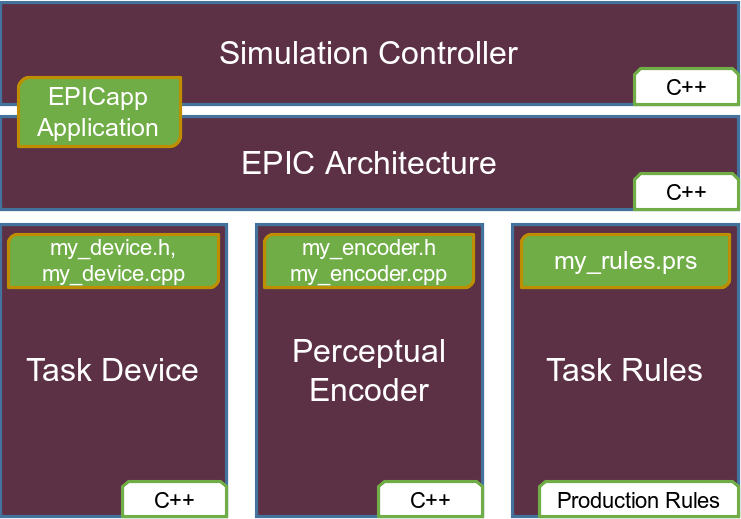
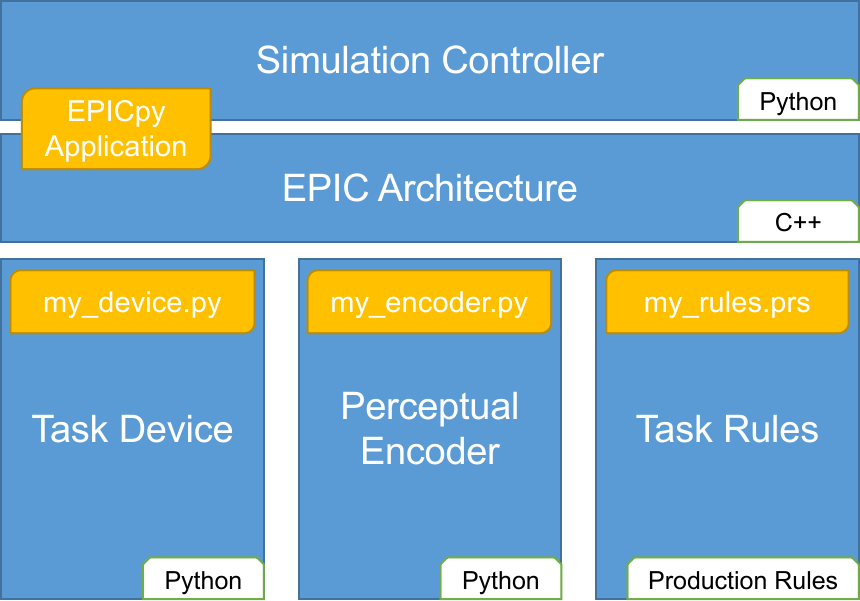

## Temporary Note To Editors
EPICpy is written in Python, but includes all the C++ files from the existing EPICLib by David Kieras, including .cpp files (for reference only) and .h (headers needed to use compiled EPICLib dynamic library) files in its Resources folder. In fact, EPICpy includes the C++ files for 2 versions of EPICLib which is a total of 405 files, and 73629 lines of C++ code. 

To get an assessment of what I actually wrote to produce EPICpy (the tool described below), please consider only the Python files which span 55 files and 11,278 lines of code.

The fastest way to obtain an EPICpy installer is via this webpage: https://cogmodlab.ucsc.edu/2022/03/14/epic/

The fastest way to run an EPICpy model is to start EPICpy and from the menu choose **TESTS->RUN_TESTS->STANDARD_RUN**. This page of the documentation explains what's being simulated in the ChoiceTask model: https://travisseymour.github.io/EPICpyDocs/example/

# Summary

Executive-Process Interactive Control (EPIC) is a computational cognitive architecture that specifies a theory of human performance and a facility to create behavioral simulations using that theory [@Meyer&Kieras1997a; @Meyer&Kieras1997b]. EPIC compacts decades of psychological theory and findings into a rich set of processors, including those that model sensory, perceptual, motor, cognitive, and memory subsystems of the human mind. EPIC is particularly suited to stimulus-response type human performance tasks including those involving multitasking and task-switching. Although many research articles, technical reports, talks, and conference presentations have been published using EPIC, these have been produced by a relatively small number of researchers. One reason EPIC has not been used more widely is due to its complex design and basis in the C++ programming language. Another challenge is the complete lack of documentation on how to set up and use its development environment. A final limitation is that EPIC is only available for MacOS. None of these issues are a problem for an experienced C++ developer, but they can be significant hurdles for those with little or limited C++ expertise, a state that is exceedingly common in the cognitive science community most likely to be interested in using EPIC. 

Rather than C++, the current approach uses the popular Python programing language. Because Python is now the language used in most introductory programming courses, researchers, their collaborators, and their students are more likely to be familiar with it than with C++. EPICpy not only provides a new Python-based graphical interface for EPIC modeling, but it allows programming simulated tasks, and perceptual models in Python [@EPICpyGithub]. In addition, EPICpy is cross-platform and provides executables for Linux, MacOS, and Windows (via WSL2). It is also possible to use EPICpy with the included Docker file on any operating system. EPICpy is accompanied by rich documentation [@EPICpyDocs] for those wanting to install and run existing simulations, those wishing to create and test new simulations, as well as those wishing to set up an environment for developing EPICpy itself. Hopefully EPICpy and its documentation will facilitate wider use of EPIC in cognitive science research, as well as easing the process of teaching EPIC to a new generation of modelers in the classroom and in workshops.

# Current Approach Using EPICapp

Interest in using computational cognitive architectures to understand human cognitive performance has hardly waned for 40 years [@Kotseruba2020]. Among the 50 or so actively used cognitive architectures, EPIC is one of the few allowing high-fidelity modeling of tasks relying on perceptual, motor, and control processes. Despite this, it can be challenging to create new EPIC simulations for many cognitive scientists. The overview of an EPIC stimulation can be seen in Figure 1.

The EPIC Architecture exists as a compiled dynamically-linked library (a MacOS .dylib file) called _EPICLib_ and is based on 64,000 lines of C++ code across 321 files. It embodies both the psychological model of a human performer and the code that allows one ot use that model to create simulations. EPICapp is a MacOS Graphical User Interface (GUI) application that allows users to load various model components and control EPIC simulations. EPICapp is written in C++ and Objective-C. Standard EPIC modeling involves working with some subset of the following components:

- **Task Device**. In EPIC a device is a simulated task environment that typically emulates a related human task. It includes virtual outputs such as a computer screen capable of displaying arbitrary graphics and text, virtual sound sources (speakers, headphones, human voice, etc.), and a variety of input devices such as a keyboard, mouse, joystick, button box, microphone. EPIC devices are written in C++.
- **Perceptual Encoders**. Although EPIC already models how visual and auditory information from the device is encoded by the virtual performer, an EPIC modeler can specify alternate models for how visual and/or auditory information is encoded in the task being studied. Perpetual encoders are written in C++.
- **Task Rules**. Task rules primarily embody the researcher's theory for how humans perform the task under investigation. If this performance theory reflected in the rules is correct, EPIC will likely produce simulated data (e.g., RT, eye-movements, response accuracy, etc.) that matches data from humans performing equivalent tasks. The hypothesized performance strategy is not expressed using a programming language, instead it is written as a set of IF-THEN production rules that specify associations between perceptual or memory states and cognitive (e.g., storing information in working memory) or motor actions (e.g., looking at a visual object, or pressing a button).

# Previous Research Using EPIC via EPICapp

Many studies have been published with EPIC models created using the existing EPICapp application^[For a larger curated list, see https://travisseymour.github.io/EPICpyDocs/epicresources/, and for a more complete collection, see https://www.researchgate.net/profile/David-Kieras].

- @Kieras2018 presented a new EPIC modeling approach using "Explanatory Sequences" with which he showed classic visual search tasks can be explained without visual attention.
- @Kieras2014 proposed a novel computational account of how people can follow individual streams of speech in a context full of irrelevant speech (i.e., the Cocktail Party Effect)
- @Zhang2014 used a computer-cluster to search in parallel for parameter combinations that helped reveal the subtle ways in which micro-strategy choices in complex multitasking environments can lead to individual differences in performance.
- @SeymourEMG used an EPIC model for an exclude-recognition task to predict electromyographic signals during performance.
- @Meyer20Questions2001 showed how EPIC can be parameterized to simulate human performance in older adults and revealed that some supposed age-related declines are actually due to strategic choices.

# Statement of need

There are several issues that motivate a new approach to EPIC modeling. One is that it is currently not easy to publicly obtain a working copy of the EPICapp software. What is available is the C++ source code for EPICLib and EPICapp for MacOS. This code is available on a Github website [@EPICappGithub], but it contains no information about how to set up or use the required development environment. Furthermore, there is no information on how to program devices, or encoders for use with EPICapp. Without instructions, use of this code would likely be restricted to experienced C++ programmer capable of reading through the source code and extracting the necessary information.

Although there have been a few conference-based workshops given by David Kieras and colleagues [e.g., @Tutorial2004], these have been limited to writing and editing production rules for existing task devices to avoid the need for C++ expertise. Although there are 2 publicly available EPIC models^[https://github.com/dekieras/EPIC_HZ_model and https://github.com/dekieras/EPIC_BMS_model], they are both offered as raw code only. To compile these devices for use in EPICapp, the entire EPICLib/EPICapp development environment would have to be set up. Thus, there is currently no option for non-C++ programmers.

There is obviously no problem with a simulation system being targeted to C++ programmers, and the aforementioned lack of development documentation could be remedied by someone with sufficient knowledge. However, it has become increasingly rare for the target Cognitive Science audience of EPIC to have any, let alone sufficient, expertise in C++. According to recent surveys administered by TIOBE @TIOBEIndex2022 and Stack Overflow @StackOverflow2022, the Python programming language is ranked significantly higher in popularity compared to C++ (currently Python is #1) and is additionally most likely to be taught as an introductory language in college courses. This presents a mismatch between the skills required to use EPIC and those being taught in Cognitive Science and Computer Science programs.

A second major issue is one of platform; only offering EPIC for the MacOS operating system further limits the potential pool of users.

Finally, EPIC only allows for basic descriptive statistics such as arithmetic mean and correlation, as well as goodness of fit statistics like R^2 and RMSE. Any other analyses would have to be programmed from scratch in C++ by the modeller who wished to use them.  Alternatively, a simulation system written in Python could take advantage of a growing cornucopia of available tools for numerical processing, statistical analyses and graphing. 

# A New Approach Using EPICpy

EPICpy offers a new cross-platform GUI application for EPIC modeling, with exectuables and detailed instructions made publicly available for Linux (Ubuntu v18.x and related Debian-based distributions), MacOS (Catalina v10.15 and newer), as well as Windows (v10.21H2 and newer via the Window Subsystem for Linux v2). For potential users on other operating systems, a Dockerfile is also provided for containerized EPIC modeling.

EPICpy is based on the Python programming language instead of C++ and follows the structure shown in Figure 2.

Although EPICLib (the compiled library containing the EPIC architecture) is still programmed in C++, all other components of the simulation system are programmed in Python. This means that modellers can program new task devices and perceptual encoders in Python. It is important to note that devices and encoders do not need to be compiled in EPICpy -- they are loaded as raw Python files directly into the application (along with a set of production rules). Thus, most EPIC modellers can use EPICapp without needing to set up the EPICpy development environment. This also means that devices and encoders can be shared between EPIC modelers without regards to operating system. To make it easy to create new devices and encoders, two demo models (including devices, encoders, and rulesets) are provided that can be edited and extended as necessary. Because the EPICpy GUI application is itself programmed in Python, those wishing to alter or extend EPICpy can do so, but in this case, EPICpy's development environment will need to be set up. Whether using one of the available EPICpy binaries, or running EPICpy from the development environment, detailed step-by-step instructions for getting started are available on the EPICpy documentation website [@EPICpyDocs].

In addition to its popularity, another advantage of using Python is the availability of powerful and easy to use statistics and graphing packages. In typical EPIC workflows, comparing simulated data to human data using statistics and graphs require moving the datafile generated by EPIC into other applications. By exposing the Pingouin statistics and graphing package [@Vallat2018], EPICpy allows device programmers access to statistical analyses ranging from simple descriptive statistics to machine-learning based analyses. It also provides both the matplotlib and seaborn packages for graphing. Thus, via EPICpy's new statistical output window, device modellers can present complex statistics and graphs directly within the EPICpy GUI following each simulation run.

EPICpy includes a large list of improvements and enhancements not available in EPICapp with the goal of enhancing EPIC modelling for existing and new EPIC modellers. These include powerful new features such as parameterized runs, batch rule running, automatic model-specific reinstatement of settings and GUI metrics. A complete list of enhancements is available in the documentation.

# Limitations

Getting an existing C++ library to work seamlessly with Python code is no easy feat. Although this coordination was partially aided by the cppyy library for the automatic creation of c++/python bindings [@cppyy2016], the back and forth translation between C++ and Python has a significant penalty in run-time. In addition, having the entire user interface, device, and all encoders in Python also contributes to a significant runtime penalty compared to EPICapp. For example, running the provided demo Choice-Task "Hard" condition for 100 trials in EPICpy takes 1.36 seconds to complete compared to 0.81 seconds in EPICapp, making the C++ version 40% faster than the Python version^[These times were achieved by disabling all graphical view output, disabling all text output, and setting all model step delays to 0.0 during each run. Context: Pop!_OS Linux v21.10, AMD Ryzen 7 3700X with 8(16) cores @ 3.6GHz, 64GB RAM]. When continuous graphic and text output are enabled, the speed advantage of C++ is even more dramatic. However, it is our hope that this trades off with the decrease in _development_ time typically associated with moving from C++ to Python, especially for inexperienced developers.

Because EPICLib itself is still compiled from C++ code, making changes to the EPIC architecture itself still requires C++ expertise. On the other hand, this means that future updates to EPIC (which is still being developed by David Kieras in C++) can be easily incorporated into EPICpy just by compiling the library and copying it into the EPICpy resources folder.

# Acknowledgements

I acknowledge the generous contributions of David Kieras who helped me understand the architecture and design patterns used in the EPIC C++ code, as well as in producing a workable EPICLIb commandline interface that served as the starting point for EPICpy. I also acknowledge the contributions of Allison Hefley and Holly Pike who helped with earlier attempts to create a cross-platform version of EPIC. 

# References
